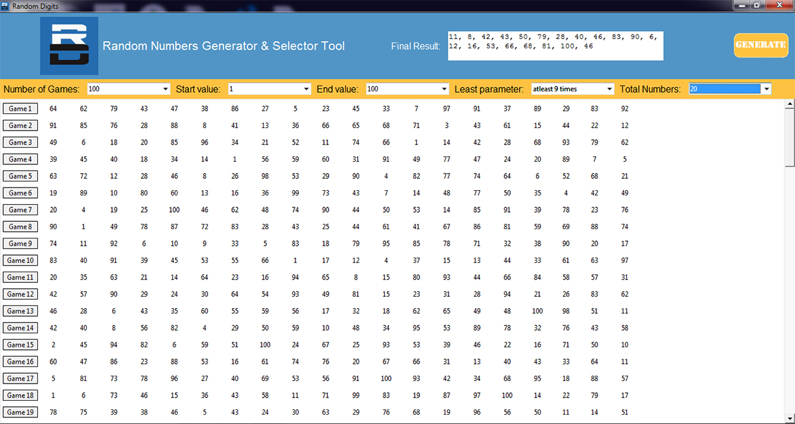

# Random-Digits
An experimentation with python to perform complex operations related to generating random digits

This is a python program to generate sequences of random numbers based on the parameters given by the user and 
create a final sequence from the generated ones, which is also based on the limiting parameters selected by the user.
Tkinter GUI is used for the graphical user interface.
